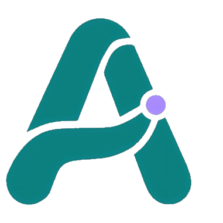

  

  # Aurélia

  **Sistema assistivo para idosos com Alzheimer em estágio inicial e seus cuidadores**

  🔗 [Landing page publicada](https://aureliatcc1.github.io/)

---

## 📖 Sobre o projeto

O **Aurélia** é um sistema integrado que conecta, em tempo real, idosos em estágio inicial de
Alzheimer e seus cuidadores. Ele é formado por um aplicativo mobile com duas interfaces
(uma simplificada para o idoso e um painel de acompanhamento para o cuidador) e um módulo de
hardware com GPS para geofencing. Este repositório contém a landing page do projeto,
apresentando a proposta em uma narrativa de rolagem dividida em quatro atos: o problema,
as duas jornadas, o funcionamento do sistema e a equipe por trás dele.

Trabalho de Conclusão de Curso (TCC) desenvolvido na ETEC Bento Quirino.

## 🧩 Problema

Pessoas em estágio inicial de Alzheimer esquecem tarefas simples do dia a dia, como tomar
remédios ou lembrar em que dia da semana estão, e podem sair de casa sem avisar ninguém.
Seus cuidadores, por sua vez, vivem em estado constante de alerta, sem visibilidade real
sobre a rotina e a localização de quem cuidam, o que gera desgaste físico e emocional para
os dois lados.

## 💡 Solução

O Aurélia une as duas pontas dessa rotina em um único sistema:

- **App do idoso**: interface simplificada, com lembretes de medicação e rotina guiados por
  uma assistente de IA que conversa por voz.
- **Painel do cuidador**: histórico de atividades, alertas em tempo real e gestão de contatos
  de emergência.
- **Módulo de geolocalização**: hardware com ESP32 e GPS que cria uma "zona segura" ao redor
  de casa e dispara um alerta imediato ao cuidador caso ela seja rompida.

## 🎯 Público-alvo

- Idosos em estágio inicial de Alzheimer, que ainda têm autonomia mas precisam de apoio leve
  no dia a dia.
- Cuidadores e familiares responsáveis por essa rotina de cuidado.

## 🛠️ Tecnologias utilizadas

| Camada | Tecnologias |
| --- | --- |
| App mobile | React Native (Expo) |
| Backend | Node.js, Firebase |
| Inteligência artificial | Groq API |
| Hardware / geofencing | ESP32, GPS NEO-6M |
| Landing page (este repositório) | HTML5, CSS3, JavaScript |

## 👥 Equipe

| Nome | Responsabilidade |
| --- | --- |
| Pedro Issaias | Desenvolvedor do Aurélia |
| Pyetro Fabricio | Desenvolvedor do Aurélia |
| Thiago Mattos | Desenvolvedor do Aurélia |
| Simone Lacerda | Orientadora |
| Tiago Jesus | Coorientador |

## 🎨 Identidade visual

### Logotipo

Letra "A" em ciano com um acento circular lavanda no cruzamento do traço, representando a
conexão entre as duas jornadas do sistema.

### Paleta de cores

| Cor | Uso | Hex |
| --- | --- | --- |
|  Teal | Cor primária | `#0F8080` |
|  Teal claro | Fundos e destaques suaves | `#E0F7FA` |
|  Lavanda | Cor de destaque (accent) | `#534AB7` |
|  Verde | Estados de sucesso | `#3B6D11` |
|  Âmbar | Estados de alerta | `#854F0B` |
|  Vermelho | Estados de perigo | `#A32D2D` |
|  Cinza claro | Fundo padrão | `#F8FAFC` |
|  Grafite | Texto principal | `#0F172A` |
|  Escuro | Fundos de destaque (calmo/sério) | `#1A1A2E` |

### Tipografia

Fonte **Inter**, nos pesos 400 (texto), 500 (subtítulos), 600 e 700 (títulos e destaques).

## 🔗 Landing page

A landing page está publicada via GitHub Pages em:
**[https://aureliatcc1.github.io/](https://aureliatcc1.github.io/)**
